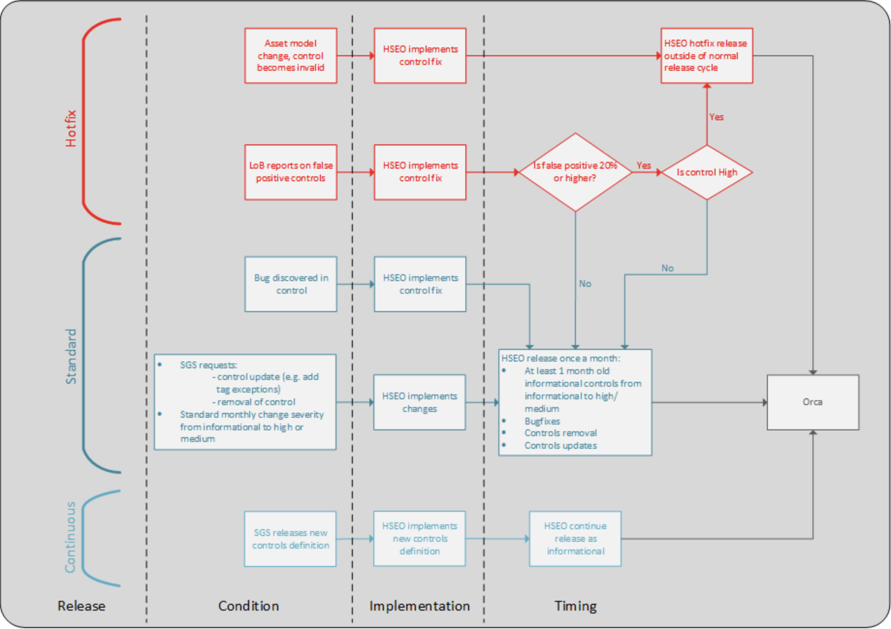
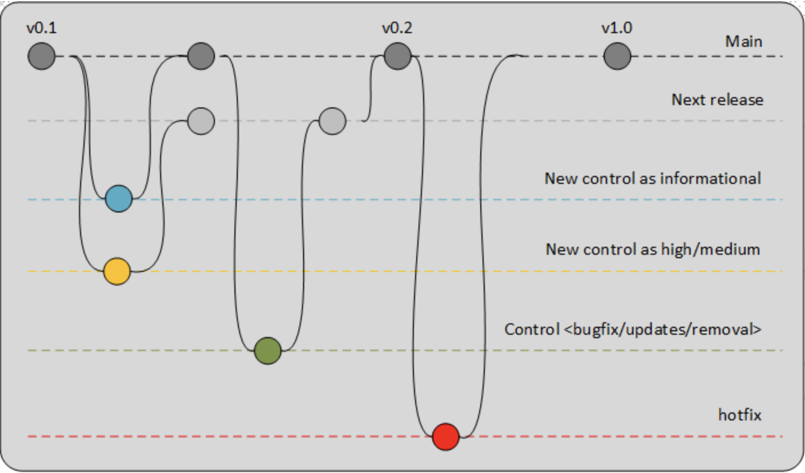

# Internal Orca Controls Release Workflow

## Table of Contents:

1. Introduction  
    - 1.1 WHAT?
    - 1.2 WHY? 
    - 1.3 WHO?
    - 1.4 HOW?
2. Technical implementation of Orca Release Process  
    - 2.1 Git branching strategy  
    - 2.2 Generalised release strategy  
      - 2.2.1 Continuous release process
      - 2.2.2 Monthly standard release process
      - 2.2.3 Hotfix release process
      
## 1. Introduction:

### 1.1 WHAT ?

- This document outlines the process for orca controls release management from a technical perspective. This will involve git workflows. The scope of this document will cover technical implementation for the release process designed in [Orca release process](../../../external/release_info/orca_controls_release_process.md).

### 1.2 WHY ?

- There are lot components involved in release process. Hence, it is necessary to understand how everything fits with the process designed and technical git implementation. This in-depth release document will help spread necessary knowledge across the team and enable everyone in the team to conduct the release.

### 1.3 WHO ?

- The target audience for this document is going to be internal GCS SRRC Hyperscaler security operations and engineering team.

### 1.4 HOW ?

- The detailed release flow diagram is as follows: 

## 2. Technical implementation of Orca Release Process:

### 2.1 Git branching strategy

- There will be ``main`` branch and ``release`` branches
- The release branches will have following naming convention: ``release-1.0.x``
- All the controls will be merged into respective release branches. This will depend on what label the control issue created has.
- At a time there will be two active release branches
  - First release branch will have controls deployed as informational
  - Active controls development will be done in second release branch
- When release branch is merged in main, main branch will be merged in the second release branch so it has all the latest changes from main.
- The release branches should always have all the changes from main i.e. release branch should be ahead of main 

### 2.2 Generalised release strategy

The overview of the release process is as follows:

There will be 3 release processes running in parallel depending on what updates are being made:
  - Continuous Release Process
  - Monthly Standard Release
  - Hotfix Release

Note: All the controls to be released during a monthly standard release, a new release branch is created off main and the severity is changed from informational to High/Medium. If there are more controls developed than what is supposed to be in the release, a new release branch is created to include those additional controls.

### 2.2.1 Continuous release process

- This will consist of new controls requests from SGS that will be initially released as informational
- These controls will be developed in a feature branch, this feature branch will be made out of main
- Once the control development is done, the severity is set to ``1.0``
- PR is created to merge this PR directly into main
- Once the PR is merged, the control will be deployed to production as informational

### 2.2.2 Monthly standard release process

- New Controls
  - The list of controls to be released will be pre-decided
  - These new controls PRs are merged as follows:
    1. All the controls to be included in the next release branch with SGS definition severity (high or medium)
    2. to next-next release branch with SGS definition severity (high or medium) if there are additional controls than to be included in the next release
    3. steps 2. iterates (e.g. next-next-next ...) if previous next release already has the controls to be included
- Bugfixes 
  - This includes high controls with less than 20% false positive or medium controls with false positive PRs are merged to next release branch
- Control Updates
  - existing controls update PRs are merged to next release branch
  - deactivated controls PRs are merged to next release branch
  - high controls with less than 20% false positive PRs are merged to next release branch
  - medium controls with false positive PRs are merged to next release branch
- Next release branch is merged to main every 4 weeks

### 2.2.3 Hotfix release process

- high controls with more than 20% false positive PRs are merged to main
- no longer valid controls PRs are merged to main
- asset model change controls PRs are merged to main